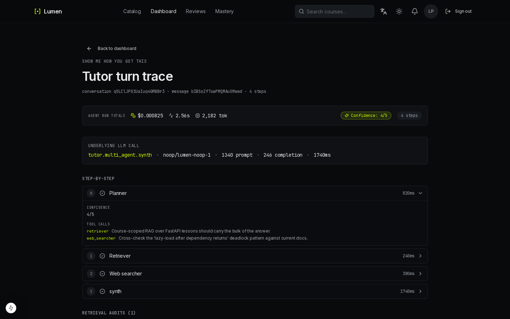
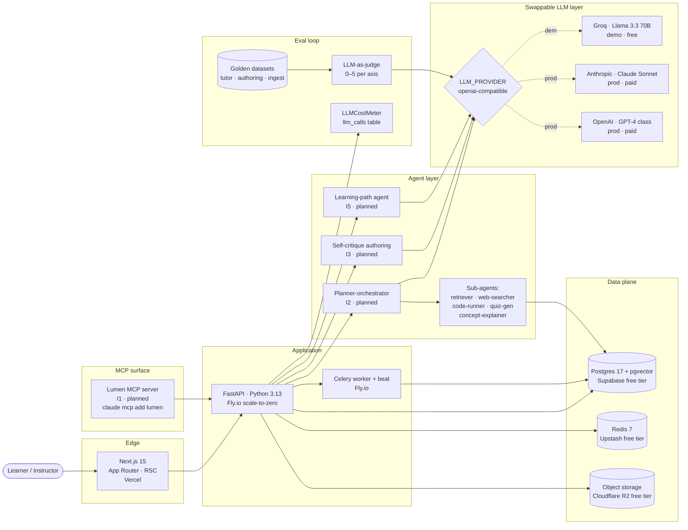

# Lumen

Lumen — an open-source, AI-first LMS built as a portfolio anchor for agentic-AI engineering work.

[](https://lumen-demo.fly.dev)
<!-- LIVE_DEMO_URL_TBD: H4's free-tier runbook (docs/deployment/free-tier.md) ships the real URL -->

[](https://github.com/ahmedEid1/E-Learning-Platform/actions/workflows/ci.yml)
[-lightgrey)](apps/backend/evals/reports/)
[](#use-lumen-from-claude-desktop)
[](LICENSE)

[Watch the 90-second walkthrough →](#)
<!-- LOOM_URL_TBD: paste the Loom URL once the H4 demo is up and the screencast is recorded -->


<!-- HERO_SCREENSHOT_TBD: operator screenshots the live demo's tutor surface with the trace expanded -->

---

## What this is

Lumen is the live demo of how multi-agent systems, retrieval-augmented generation, the Model Context Protocol, and evaluation rigor come together inside a real product. It is the centrepiece of an agentic-AI engineering portfolio — a self-hostable LMS that doubles as a working argument for "I build production-grade AI systems, not toy demos."

- **AI tutor with citations** — course-scoped retrieval-augmented generation; every claim points at a specific lesson chunk.
- **Multi-modal ingest** — paste a YouTube, Notion, or Google Docs URL and get a draft course back; instructor reviews before commit.
- **AI-assisted authoring** — brief → outline → lesson bodies → quizzes; nothing auto-persists.
- **Spaced-repetition reviews** — FSRS-6 scheduler; every completed quiz joins the learner's queue.
- **Open Badges 3.0** — Ed25519-signed verifiable credentials; PDF certificate as the human-readable fallback.
- **Observable agent traces** — every LLM call recorded with tokens, cost, latency, and (soon) the planner's tool-call log.
- **Eval suite** — 30-item tutor + 10-item authoring + 10-item ingest golden datasets; LLM-as-judge; CI smoke gate.

---

## Architecture



Architecture B+: AI-first OSS LMS. Provider-agnostic LLM layer; the live demo runs Groq Llama 3.3 70B for $0, prod-ready for Anthropic or OpenAI via the same `LLMProvider` abstraction. Every agent call goes through the cost-meter so observability and the per-user 24h budget guard work identically across providers. See [docs/architecture.md](docs/architecture.md) for the full topology.

---

## The agentic patterns I built

The resume bullets, with links to the code. Items marked `planned — Phase I` ship next; everything else is on `main` today.

- **Planner-orchestrator multi-agent tutor** *(planned — Phase I, item I2)* — planner reads the question and picks among `retriever`, `web_searcher`, `code_runner`, `quiz_generator`, `concept_explainer`; hard cap of 5 tool-call rounds per turn; every step traced via OpenLLMetry. The frontend shows the agent's plan and which tools fired — the moat is showing how the agent thinks, not just what it said.
- **Self-critique authoring agent** *(planned — Phase I, item I3)* — researcher → outliner → critic → reviser → lesson-drafter → final-critic; max three revisions; full chain persisted as `CourseDraftTrace` so an instructor can replay the reasoning before accepting a draft.
- **Lumen MCP server** *(planned — Phase I, item I1)* — exposes the LMS surface (`list_courses`, `ask_tutor`, `list_my_due_reviews`, `create_course_draft`, …) as MCP tools over stdio + HTTP; OAuth client-credentials for service-to-service; installable in Claude Desktop with `claude mcp add lumen`; published to `registry.modelcontextprotocol.io`.
- **Eval harness with LLM-as-judge** *(shipped — Phase H, item H2)* — 30-item tutor suite + 10 authoring + 10 ingest under [`apps/backend/evals/`](apps/backend/evals/). Run with `python -m app.evals run --suite tutor`. Judge scores each item 0–5 on suite-specific axes; reports land as JSONL with mean + regression vs. previous run. CI smoke gate runs a 3-item subset on every PR. Admin dashboard at `/admin/evals`.
- **Production-grade observability** *(H1 shipped, H7 planned)* — every LLM call's prompt/completion tokens, USD cost, latency, and outcome recorded in the `llm_calls` table (Alembic 0022). Per-user 24h budget guard returns HTTP 429 `llm.budget_exceeded` once the threshold trips. H7 adds Celery queue depth, retrieval-quality drill-down, and a per-trace expander to `/admin/observability`.
- **Personalized learning-path agent** *(planned — Phase I, item I5)* — learner states a goal ("become a backend engineer in 6 months"), the agent assembles an 8-course plan respecting prerequisites and FSRS load, schedules it weekly, and re-plans monthly as new courses and progress data arrive.

---

## What's running today

| Feature                                                  | Status |
|----------------------------------------------------------|--------|
| Course-scoped RAG tutor with citations (Phase E1)        | ✅ shipped (1.0.0-rebuild) |
| AI-assisted authoring (Phase E2)                         | ✅ shipped (1.0.0-rebuild) |
| Multi-modal ingest — YouTube / Notion / Google Docs (E3) | ✅ shipped (1.0.0-rebuild) |
| FSRS-6 spaced-repetition reviews (Phase E4)              | ✅ shipped (1.0.0-rebuild) |
| Open Badges 3.0 / W3C VC credentials (Phase E5)          | ✅ shipped (1.0.0-rebuild) |
| Tiptap block editor (Phase E6)                           | ✅ shipped (1.0.0-rebuild) |
| Mastery dashboard (Phase E7)                             | ✅ shipped (1.0.0-rebuild) |
| pgvector + provider-agnostic embeddings (Phase E0)       | ✅ shipped (1.0.0-rebuild) |
| WCAG 2.2 AA axe-core CI gate (Phase D5)                  | ✅ shipped (1.0.0-rebuild) |
| LLM cost meter + per-user 24h budget guard (H1)          | ✅ shipped (wave 1) |
| Eval harness + golden datasets + judge dashboard (H2)    | ✅ shipped (wave 1) |
| Playwright e2e against the live stack (H3)               | ✅ shipped (wave 1) |
| Production-exposure security pass (H6)                   | ✅ shipped (wave 1) |
| Free-tier live demo deployment (H4)                      | 🚧 in progress (wave 2) |
| README rewrite for agentic-AI positioning (H5)           | 🚧 in progress (this file) |
| Agent-trace + retrieval observability surface (H7)       | 🚧 in progress (wave 2) |
| Lumen MCP server (I1)                                    | ⏳ Phase I |
| Multi-agent planner-orchestrator tutor (I2)              | ⏳ Phase I |
| Self-critique authoring agent (I3)                       | ⏳ Phase I |
| Agent-trace observability surface for learners (I4)      | ⏳ Phase I |
| Personalized learning-path agent (I5)                    | ⏳ Phase I |

---

## Eval scores

Latest tutor eval (n=30): **TBD/5** — judge: Llama 3.3 70B (Groq). [See full report →](apps/backend/evals/reports/)

Run yourself:

```bash
python -m app.evals run --suite tutor
```

The harness writes a JSONL report under `apps/backend/evals/reports/` containing per-item scores on `faithfulness`, `citation_correctness`, and `helpfulness`, the mean across the suite, and a regression diff against the previous run. `--suite authoring` and `--suite ingest` cover the other two golden datasets. CI runs a 3-item smoke on every PR via [`.github/workflows/pnpm-eval-smoke.yml`](.github/workflows/pnpm-eval-smoke.yml).

---

## Run it locally

**Prereqs.** Docker Desktop 4.30+ (or Docker Engine 27 + Compose v2). Optional: an LLM API key — a Groq key is recommended for the free tier; without one, the AI features fall back to the deterministic `noop` provider so the rest of the app still works.

```bash
git clone https://github.com/ahmedEid1/E-Learning-Platform.git
cd E-Learning-Platform
cp .env.example .env
docker compose up
make migrate
make seed
```

Then open <http://localhost:3000> and log in with one of the seeded accounts:

| Role       | Email              | Password    |
|------------|--------------------|-------------|
| Admin      | admin@lumen.test   | Admin!2026  |
| Instructor | teacher@lumen.test | Teach!2026  |
| Student    | student@lumen.test | Learn!2026  |

For real LLM features (tutor, authoring, ingest, evals), set the following in `.env` and restart:

```env
LLM_PROVIDER=openai
OPENAI_API_BASE=https://api.groq.com/openai/v1
OPENAI_API_KEY=<your-groq-key>
LLM_MODEL=llama-3.3-70b-versatile
```

The same `LLMProvider` abstraction also accepts native Anthropic (`LLM_PROVIDER=anthropic`) and OpenAI (`LLM_PROVIDER=openai` with the default base URL) configurations — no code changes, switch by env var.

---

## Deploy it (Oracle Cloud Always Free)

The live demo runs on **one** Oracle Cloud Always-Free Ampere A1 VM (4 OCPU + 24 GB RAM + 200 GB block, ARM64 Ubuntu 24.04) — $0/mo, **forever**, no card charged. The unmodified `docker-compose.prod.yml` brings up FastAPI + Celery worker + beat + Postgres-pgvector + Redis + MinIO + a containerised Caddy 2 that auto-fetches a Let's Encrypt cert. Putting Cloudflare's DNS proxy in front is an optional next step, not a prerequisite.

tl;dr after you have an Oracle account and the VM is running:

```bash
ssh ubuntu@<vm-public-ip>
curl -fsSL https://raw.githubusercontent.com/ahmedEid1/E-Learning-Platform/master/scripts/oracle-bootstrap.sh | sudo bash
# log out, log back in as the new admin user, then:
git clone https://github.com/ahmedEid1/E-Learning-Platform.git lumen && cd lumen
cp .env.example .env.production    # fill APP_DOMAIN + secrets (see runbook step 5)
docker compose -f docker-compose.prod.yml --env-file .env.production up -d
```

Full runbook (VM creation through TLS + smokes): [docs/deployment/oracle-vps.md](docs/deployment/oracle-vps.md). Cost callout: steady-state **$0/mo, forever** on the Always-Free tier; the per-user 24h LLM budget guard caps spend at $1/user/day by default and the operator can dial it lower in `.env`.

---

## Use Lumen from Claude Desktop

Lumen ships an MCP server (Phase I, item I1) that exposes its catalog, RAG tutor, FSRS review queue, AI authoring pipeline, and multi-modal ingest as nine tools. Add it as an MCP source in Claude Desktop:

```json
// ~/Library/Application Support/Claude/claude_desktop_config.json (macOS)
// %APPDATA%\Claude\claude_desktop_config.json (Windows)
{
  "mcpServers": {
    "lumen": {
      "command": "uvx",
      "args": ["--from", "lumen-backend", "python", "-m", "app.mcp", "--transport", "stdio"],
      "env": {
        "LUMEN_MCP_AUTH_TOKEN": "<your-token>",
        "DATABASE_URL": "<postgres-url>"
      }
    }
  }
}
```

Generate the `LUMEN_MCP_AUTH_TOKEN` value with `make mcp-token` against your running Lumen instance — that prints a fresh OAuth `client_id` + `client_secret` pair; paste the secret as the env value. For Claude Code, the equivalent one-liner is `claude mcp add lumen -- python -m app.mcp --transport stdio` (set `LUMEN_MCP_AUTH_TOKEN` in your shell first). Full operator guide: [docs/mcp.md](docs/mcp.md).

Once installed, ask Claude `'list my Lumen courses'` and watch the MCP tool calls fire in the desktop sidebar — the planner picks among `list_courses`, `get_course`, `ask_tutor`, `list_my_due_reviews`, `grade_review_card`, `create_course_draft`, `ingest_url_to_draft`, `list_my_progress`, and `search_lesson_content`.

---

## Built by

**Ahmed Hobeishy** — full-stack engineer (Python + TypeScript + DevOps), based in Essen, Germany. Building Lumen as the centrepiece of an agentic-AI engineering portfolio. **Currently open to senior agentic-AI engineering roles.**

- LinkedIn: <https://www.linkedin.com/in/ahmedhobeishy/>
- GitHub: <https://github.com/ahmedEid1>
- Reach out via LinkedIn, or open an issue on this repo.

---

## License + status

MIT — see [LICENSE](LICENSE).

Status: actively built. Phase H wave-1 shipped 2026-05-22; Phase H wave-2 (live demo + this README + agent-trace dashboard) in flight; Phase I (MCP server, multi-agent tutor, self-critique authoring, learning-path agent) queued.
