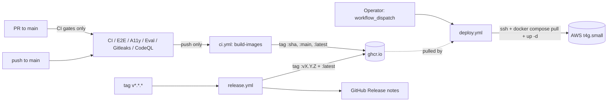

# CI / CD on the main branch

This page documents how code lands in front of users at
`https://lumen.ahmedhobeishy.tech`. Two pipelines run in lock-step:

- **CI** — `.github/workflows/{ci,e2e,accessibility,pnpm-eval-smoke,gitleaks,codeql}.yml`
  proves every commit on every PR and every push to `main` is
  green before any image leaves the workshop.
- **CD** — `.github/workflows/{ci.yml (build-images), deploy.yml,
  release.yml}` builds container images, pushes them to GHCR, and
  rolls the AWS VM.



## Branches and triggers

| Branch / event | What fires | Result |
|---|---|---|
| PR (any → `main` or `main`) | `ci.yml` jobs (backend/frontend lint+test), `e2e.yml`, `accessibility.yml`, `pnpm-eval-smoke.yml`, `gitleaks.yml`, `codeql.yml` | red blocks merge |
| Push to `main` | Same as above **plus** `ci.yml:build-images` | new images on GHCR with `:<sha>`, `:main`, `:latest` tags |
| Push to `main` | Same CI but build-images tags only `:main` + `:<sha>` (no `:latest` — see below) | images on GHCR; deploy is **not** automatic |
| Tag `v*.*.*` | `release.yml` | images tagged `:vX.Y.Z` + `:latest`, GitHub Release drafted |
| Manual | `workflow_dispatch` on `deploy.yml` | operator picks image tag (defaults `latest`) + optional rollback commit_sha, ships to AWS |

**Deploy is manual on purpose.** The previous design used GitHub's
`workflow_run` to chain CI → Deploy automatically once every gate
went green. Two structural problems blocked that path:

1. `workflow_run` fires once *per upstream workflow*, not after all
   succeed. With three workflows in the gate (CI, E2E, A11y), every
   push to main would queue 3 sequential deploys, and the first
   would fire before the slowest gate had finished — defeating
   "ship only after all gates green."
2. `workflow_run` triggers only fire from workflow files living on
   the repository's **default branch**. The default here is `legacy`
   and main is 358+ commits ahead; `deploy.yml` lives on main
   only, so the trigger would never fire even if (1) were solved.

Both are solvable (consolidate into one workflow, or query the
GitHub API for sibling-workflow status on the same SHA before
proceeding). They're worth doing for a multi-engineer setup but
not for a solo portfolio anchor where the operator is the one
clicking "Deploy" anyway. See "Future enhancements" below.

## Image-tag matrix

| Origin | api tag | web tag |
|---|---|---|
| Push to `main` | `:<sha>`, `:main`, `:latest` | `:<sha>`, `:main`, `:latest` |
| Push to `main` | `:<sha>`, `:main` | `:<sha>`, `:main` |
| Tag `v1.2.3` (release.yml) | `:v1.2.3`, `:latest` | `:v1.2.3`, `:latest` |

`:latest` only moves on `main` pushes and tagged releases. Pushes
to the stale `main` branch can't accidentally roll back the live
AWS box by clobbering `:latest`.

## What the AWS VM actually consumes

`docker-compose.prod.yml` declares:

```yaml
api:
  image: ghcr.io/ahmedeid1/lumen-api:${IMAGE_TAG:-latest}
web:
  image: ghcr.io/ahmedeid1/lumen-web:${IMAGE_TAG:-latest}
```

So the VM pulls `:latest` by default. `deploy.yml` overrides
`IMAGE_TAG=<sha>` during workflow_dispatch if the operator picks a
specific tag, useful for rollbacks ("redeploy `:v1.2.2`").

## CD flow in detail

`deploy.yml` ssh-es into the box (Phase 1 secrets below), runs:

1. `git fetch origin main && git reset --hard origin/main` — keeps the
   on-box compose file aligned with the rolled-out commit. Or, on
   rollback (when the operator passes `commit_sha`),
   `git checkout <sha>` in detached-HEAD mode so the compose file
   matches the pinned image. See the "Rollback" recipe below.
2. `docker compose pull api web worker beat` — fetches the new images
   (authenticated via `GHCR_PULL_TOKEN` if the package is private,
   anonymous if public).
3. `docker compose up -d --remove-orphans api worker beat web` — rolls
   the stack. Compose only restarts services whose image / env
   actually changed.
4. `docker compose exec api alembic upgrade head` — runs pending
   migrations (idempotent; skip via `workflow_dispatch` input if
   needed).
5. **Smoke tests** — hits `https://${APP_DOMAIN}/api/v1/health/live`
   and `/ready` every 5 s for 2.5 min. Fails the job loudly if the
   smokes never go green.

If smokes fail, the job logs the post-deploy compose state and
exits 1. **There is no automatic rollback** — manual remediation is
expected (the operator's first instinct in a broken deploy is
usually to investigate root cause, not blindly roll back). To
rollback to a known-good tag, pass both inputs so the compose file
on the box matches the image:

```bash
gh workflow run deploy.yml \
  -f image_tag=<sha-of-last-good-deploy> \
  -f commit_sha=<sha-of-last-good-deploy> \
  -f run_migrations=false
```

`commit_sha` is the rollback-critical input — without it, the box
syncs to `origin/main` HEAD on every deploy, which means an
old-image rollback would launch yesterday's container against
today's compose definition (new services / renamed env vars /
adjusted healthchecks). Passing both keeps the rollout coherent.

## Required repo secrets

`Settings → Secrets and variables → Actions → New repository secret`:

| Name | Value | Used by |
|---|---|---|
| `AWS_SSH_HOST` | `lumen.ahmedhobeishy.tech` (or the EIP `3.74.54.147`) | deploy.yml |
| `AWS_SSH_USER` | `lumen` | deploy.yml |
| `AWS_SSH_PRIVATE_KEY` | full PEM contents of `~/.ssh/lumen-prod.pem` | deploy.yml |
| `AWS_KNOWN_HOSTS` | output of `ssh-keyscan -H lumen.ahmedhobeishy.tech` (locks down first-connect trust) | deploy.yml |
| `APP_DOMAIN` | `lumen.ahmedhobeishy.tech` | deploy.yml smokes |
| `GHCR_PULL_TOKEN` | classic GitHub PAT, `read:packages` scope only | deploy.yml (omit if images are public) |

`GITHUB_TOKEN` (used by `ci.yml:build-images` to push to GHCR) is
auto-provided by Actions and doesn't need to be added.

To **make the packages public** (avoiding `GHCR_PULL_TOKEN`):
`Packages → lumen-api → Package settings → Change visibility → Public`,
repeat for `lumen-web`. Recommended for portfolio projects — pulls
are anonymous and there's no PAT to rotate.

## Box-side prerequisites (one-time)

The deploy targets a box already provisioned by
`scripts/aws-bootstrap.sh` (or `infra/aws/` Terraform). The box must:

- have `~/lumen` cloned at `main`
- have `~/.env.production` filled in (`APP_DOMAIN`, `JWT_SECRET`,
  `OPENAI_API_KEY=<groq>`, etc. — see `docs/deployment/aws-vps.md`)
- run Docker with the `lumen` user in the `docker` group
- have outbound HTTPS to `ghcr.io`

If pulling private images, **either** the box's `lumen` user is
already `docker login`'d to ghcr (long-lived) **or** the deploy job
re-runs `docker login` each time using `GHCR_PULL_TOKEN`.

## Editing the pipelines

- **Add a new CI gate**: drop a new workflow file in
  `.github/workflows/`. Since deploys are manual
  (`workflow_dispatch`), there's no auto-trigger to update — but
  consider listing the new gate as a required check in branch
  protection so it actually blocks merges to main.
- **Change the canonical branch**: search `.github/workflows/` for
  `main` and update. Also update the `:latest` tag conditional in
  `ci.yml:build-images`.
- **Cut a release**: `git tag v1.2.3 && git push --tags` —
  `release.yml` handles the rest.

## Why this shape

For a single-operator portfolio anchor with one production box,
"green CI, then click Deploy" is the right cadence. The gates in
front (CI + E2E + A11y) catch the things that bite, the manual
`workflow_dispatch` gives a panic button for rollbacks, and
`release.yml` exists so you can stamp a versioned image when
something is worth pinning. No staging environment, no blue/green —
the VM has 2 GB RAM and one Caddy reverse-proxy in front; the
operational cost of a more elaborate setup outweighs the benefit
at this scale.

## Future enhancements

When the project grows past a solo operator, the things worth adding:

- **Auto-deploy on green CI** — consolidate `e2e.yml` + `accessibility.yml`
  into jobs inside `ci.yml` (with shared docker-compose setup), then add
  a `deploy` job in `ci.yml` that runs after all gates pass on main.
  Or keep the workflows separate and add a `wait-for-checks` step at
  the top of `deploy.yml` that polls the GitHub API for sibling-workflow
  status on the same SHA. Either move solves the "fires per workflow"
  problem the current setup ducked.
- **Default-branch flip** — set the GitHub default branch to `main`
  (Settings → Branches → default), and remove the `:main` paths from
  `ci.yml`. The 358-commit gap to `legacy` makes the dual-branch
  trigger more confusing than useful.
- **Staging environment** — second AWS t4g.small (or t4g.micro on
  free tier) at `staging.lumen.ahmedhobeishy.tech`. CD auto-rolls
  staging on main push, prod requires manual promote.
- **Trivy gate** — flip `exit-code` from `"0"` to `"1"` on the
  Trivy scans in `ci.yml:build-images` once the base images are
  pinned to digests so CVE noise stays low.
- **Branch protection** — `Settings → Branches → main → Require
  status checks before merging`, list the 5 gates. Loses the ability
  to push directly to main but gains the guarantee that every
  commit reaching the canonical branch has passed all checks.
