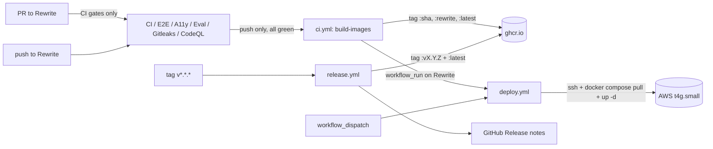

# CI / CD on the Rewrite branch

This page documents how code lands in front of users at
`https://lumen.ahmedhobeishy.tech`. Two pipelines run in lock-step:

- **CI** — `.github/workflows/{ci,e2e,accessibility,pnpm-eval-smoke,gitleaks,codeql}.yml`
  proves every commit on every PR and every push to `Rewrite` is
  green before any image leaves the workshop.
- **CD** — `.github/workflows/{ci.yml (build-images), deploy.yml,
  release.yml}` builds container images, pushes them to GHCR, and
  rolls the AWS VM.



## Branches and triggers

| Branch / event | What fires | Result |
|---|---|---|
| PR (any → `Rewrite` or `main`) | `ci.yml` jobs (backend/frontend lint+test), `e2e.yml`, `accessibility.yml`, `pnpm-eval-smoke.yml`, `gitleaks.yml`, `codeql.yml` | red blocks merge |
| Push to `Rewrite` | Same as above **plus** `ci.yml:build-images` | new images on GHCR; `deploy.yml` auto-fires via `workflow_run` |
| Push to `main` | Same CI but build-images tags only `:main` + `:<sha>` (no `:latest` — see below) | images on GHCR; deploy does **not** auto-fire |
| Tag `v*.*.*` | `release.yml` | images tagged `:vX.Y.Z` + `:latest`, GitHub Release drafted |
| Manual | `workflow_dispatch` on `deploy.yml` | operator picks image tag (defaults `latest`), deploys to AWS |

## Image-tag matrix

| Origin | api tag | web tag |
|---|---|---|
| Push to `Rewrite` | `:<sha>`, `:rewrite`, `:latest` | `:<sha>`, `:rewrite`, `:latest` |
| Push to `main` | `:<sha>`, `:main` | `:<sha>`, `:main` |
| Tag `v1.2.3` (release.yml) | `:v1.2.3`, `:latest` | `:v1.2.3`, `:latest` |

`:latest` only moves on `Rewrite` pushes and tagged releases. Pushes
to the stale `main` branch can't accidentally roll back the live
AWS box by clobbering `:latest`.

## What the AWS VM actually consumes

`docker-compose.prod.yml` declares:

```yaml
api:
  image: ghcr.io/ahmedeid1/lumen-api:${IMAGE_TAG:-latest}
web:
  image: ghcr.io/ahmedeid1/lumen-web:${IMAGE_TAG:-latest}
```

So the VM pulls `:latest` by default. `deploy.yml` overrides
`IMAGE_TAG=<sha>` during workflow_dispatch if the operator picks a
specific tag, useful for rollbacks ("redeploy `:v1.2.2`").

## CD flow in detail

`deploy.yml` ssh-es into the box (Phase 1 secrets below), runs:

1. `git fetch origin Rewrite && git reset --hard origin/Rewrite` — keeps the
   on-box compose file aligned with the rolled-out commit.
2. `docker compose pull api web worker beat` — fetches the new images
   (authenticated via `GHCR_PULL_TOKEN` if the package is private,
   anonymous if public).
3. `docker compose up -d --remove-orphans api worker beat web` — rolls
   the stack. Compose only restarts services whose image / env
   actually changed.
4. `docker compose exec api alembic upgrade head` — runs pending
   migrations (idempotent; skip via `workflow_dispatch` input if
   needed).
5. **Smoke tests** — hits `https://${APP_DOMAIN}/api/v1/health/live`
   and `/ready` every 5 s for 2.5 min. Fails the job loudly if the
   smokes never go green.

If smokes fail, the job logs the post-deploy compose state and
exits 1. **There is no automatic rollback** — manual remediation is
expected (the operator's first instinct in a broken deploy is
usually to investigate root cause, not blindly roll back). To
rollback to a known-good tag:

```bash
gh workflow run deploy.yml -f image_tag=<sha-of-last-good-deploy> -f run_migrations=false
```

## Required repo secrets

`Settings → Secrets and variables → Actions → New repository secret`:

| Name | Value | Used by |
|---|---|---|
| `AWS_SSH_HOST` | `lumen.ahmedhobeishy.tech` (or the EIP `3.74.54.147`) | deploy.yml |
| `AWS_SSH_USER` | `lumen` | deploy.yml |
| `AWS_SSH_PRIVATE_KEY` | full PEM contents of `~/.ssh/lumen-prod.pem` | deploy.yml |
| `AWS_KNOWN_HOSTS` | output of `ssh-keyscan -H lumen.ahmedhobeishy.tech` (locks down first-connect trust) | deploy.yml |
| `APP_DOMAIN` | `lumen.ahmedhobeishy.tech` | deploy.yml smokes |
| `GHCR_PULL_TOKEN` | classic GitHub PAT, `read:packages` scope only | deploy.yml (omit if images are public) |

`GITHUB_TOKEN` (used by `ci.yml:build-images` to push to GHCR) is
auto-provided by Actions and doesn't need to be added.

To **make the packages public** (avoiding `GHCR_PULL_TOKEN`):
`Packages → lumen-api → Package settings → Change visibility → Public`,
repeat for `lumen-web`. Recommended for portfolio projects — pulls
are anonymous and there's no PAT to rotate.

## Box-side prerequisites (one-time)

The deploy targets a box already provisioned by
`scripts/aws-bootstrap.sh` (or `infra/aws/` Terraform). The box must:

- have `~/lumen` cloned at `Rewrite`
- have `~/.env.production` filled in (`APP_DOMAIN`, `JWT_SECRET`,
  `OPENAI_API_KEY=<groq>`, etc. — see `docs/deployment/aws-vps.md`)
- run Docker with the `lumen` user in the `docker` group
- have outbound HTTPS to `ghcr.io`

If pulling private images, **either** the box's `lumen` user is
already `docker login`'d to ghcr (long-lived) **or** the deploy job
re-runs `docker login` each time using `GHCR_PULL_TOKEN`.

## Editing the pipelines

- **Add a new CI gate**: drop a new workflow file in
  `.github/workflows/`. The deploy auto-trigger (`workflow_run` in
  `deploy.yml`) lists the workflows by name — add yours there if it
  should also gate deploys.
- **Change the canonical branch**: search `.github/workflows/` for
  `Rewrite` and update. Also update the `:latest` tag conditional in
  `ci.yml:build-images`.
- **Cut a release**: `git tag v1.2.3 && git push --tags` —
  `release.yml` handles the rest.

## Why this shape

For a single-operator portfolio anchor with one production box,
"push to Rewrite → live in ~4 min" is the right cadence. The gates
in front (CI + E2E + A11y) catch the things that bite, the manual
`workflow_dispatch` gives a panic button for rollbacks, and
`release.yml` exists so you can stamp a versioned image when
something is worth pinning. No staging environment, no blue/green —
the VM has 2 GB RAM and one Caddy reverse-proxy in front; the
operational cost of a more elaborate setup outweighs the benefit
at this scale.
