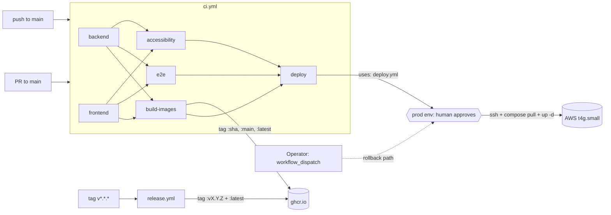

# CI / CD on the main branch

This page documents how code lands in front of users at
`https://lumen.ahmedhobeishy.tech`. The whole gate is one workflow:

- **`.github/workflows/ci.yml`** — six chained jobs (backend, frontend,
  build-images, e2e, accessibility, deploy) wired together by `needs:`.
  Every PR and every push to `main` walks the chain; only push-to-main
  runs build-images and deploy.
- **`.github/workflows/deploy.yml`** — reusable workflow invoked from
  ci.yml's `deploy` job (and still callable manually via
  `workflow_dispatch` for rollbacks). Gated on the **`production`
  GitHub Environment**, which pauses every run for an explicit
  approval click before the SSH steps fire.
- **`.github/workflows/{release,pnpm-eval-smoke,gitleaks,codeql}.yml`**
  — tagged-release publish + the lower-priority security/eval gates.



## Branches and triggers

| Branch / event | What fires | Result |
|---|---|---|
| PR (any → `main`) | ci.yml's `backend`, `frontend`, `e2e`, `accessibility` jobs + `pnpm-eval-smoke.yml`, `gitleaks.yml`, `codeql.yml`. **No** `build-images` or `deploy`. | red blocks merge |
| Push to `main` | Same as above **plus** `build-images` (publishes `:<sha>`, `:main`, `:latest`) **plus** `deploy` (gated on `production` environment approval) | new images on GHCR; deploy pauses for a human click in the GitHub UI |
| Tag `v*.*.*` | `release.yml` | images tagged `:vX.Y.Z` + `:latest`, GitHub Release drafted |
| Manual | `workflow_dispatch` on `deploy.yml` | operator picks image tag + optional rollback commit_sha; same approval gate applies |

**Auto-deploy with a human approval gate.** The `deploy` job in
ci.yml fires automatically on every green push to `main` (it
`needs:` every upstream gate, so it can't fire until all five
predecessors pass). But it doesn't immediately SSH to the box —
`environment: production` parks the run in the GitHub UI and waits
for the configured reviewer (`ahmedEid1`) to click **Approve and
deploy**. That gives the operator one place to glance at "what's
about to ship" before it actually ships, without the friction of
typing `gh workflow run` every time.

The environment also enforces a branch policy: only refs that match
`main` can deploy to `production`. So a stray push to a personal
branch can't accidentally route through the deploy job even if
some future edit relaxes the `if:` condition.

For emergency rollbacks the operator still invokes deploy.yml
directly via `gh workflow run deploy.yml -f image_tag=<sha>` — that
path also routes through the same approval gate (intentional; it's
the operator's audit trail of "yes I really want to roll back"),
but skips re-running ci.yml since the gate has already passed for
that older SHA.

## Image-tag matrix

| Origin | api tag | web tag |
|---|---|---|
| Push to `main` | `:<sha>`, `:main`, `:latest` | `:<sha>`, `:main`, `:latest` |
| Tag `v1.2.3` (release.yml) | `:v1.2.3`, `:latest` | `:v1.2.3`, `:latest` |

`:latest` moves on every push to `main` and every tagged release.
The auto-deploy job pins to `:<sha>` (passed via `with:` to
deploy.yml) rather than `:latest` so a second push that lands while
this run is paused at the approval gate can't race the deploy onto
a newer image than ci.yml actually verified.

## What the AWS VM actually consumes

`docker-compose.prod.yml` declares:

```yaml
api:
  image: ghcr.io/ahmedeid1/lumen-api:${IMAGE_TAG:-latest}
web:
  image: ghcr.io/ahmedeid1/lumen-web:${IMAGE_TAG:-latest}
```

So the VM pulls `:latest` by default. `deploy.yml` overrides
`IMAGE_TAG=<sha>` during workflow_dispatch if the operator picks a
specific tag, useful for rollbacks ("redeploy `:v1.2.2`").

## CD flow in detail

`deploy.yml` ssh-es into the box (Phase 1 secrets below), runs:

1. `git fetch origin main && git reset --hard origin/main` — keeps the
   on-box compose file aligned with the rolled-out commit. Or, on
   rollback (when the operator passes `commit_sha`),
   `git checkout <sha>` in detached-HEAD mode so the compose file
   matches the pinned image. See the "Rollback" recipe below.
2. `docker compose pull api web worker beat` — fetches the new images
   (authenticated via `GHCR_PULL_TOKEN` if the package is private,
   anonymous if public).
3. `docker compose up -d --remove-orphans api worker beat web` — rolls
   the stack. Compose only restarts services whose image / env
   actually changed.
4. `docker compose exec api alembic upgrade head` — runs pending
   migrations (idempotent; skip via `workflow_dispatch` input if
   needed).
5. **Smoke tests** — hits `https://${APP_DOMAIN}/api/v1/health/live`
   and `/ready` every 5 s for 2.5 min. Fails the job loudly if the
   smokes never go green.

If smokes fail, the job logs the post-deploy compose state and
exits 1. **There is no automatic rollback** — manual remediation is
expected (the operator's first instinct in a broken deploy is
usually to investigate root cause, not blindly roll back). To
rollback to a known-good tag, pass both inputs so the compose file
on the box matches the image:

```bash
gh workflow run deploy.yml \
  -f image_tag=<sha-of-last-good-deploy> \
  -f commit_sha=<sha-of-last-good-deploy> \
  -f run_migrations=false
```

`commit_sha` is the rollback-critical input — without it, the box
syncs to `origin/main` HEAD on every deploy, which means an
old-image rollback would launch yesterday's container against
today's compose definition (new services / renamed env vars /
adjusted healthchecks). Passing both keeps the rollout coherent.

## Required repo secrets

`Settings → Secrets and variables → Actions → New repository secret`:

| Name | Value | Used by |
|---|---|---|
| `AWS_SSH_HOST` | `lumen.ahmedhobeishy.tech` (or the EIP `3.74.54.147`) | deploy.yml |
| `AWS_SSH_USER` | `lumen` | deploy.yml |
| `AWS_SSH_PRIVATE_KEY` | full PEM contents of `~/.ssh/lumen-prod.pem` | deploy.yml |
| `AWS_KNOWN_HOSTS` | output of `ssh-keyscan -H lumen.ahmedhobeishy.tech` (locks down first-connect trust) | deploy.yml |
| `APP_DOMAIN` | `lumen.ahmedhobeishy.tech` | deploy.yml smokes |
| `GHCR_PULL_TOKEN` | classic GitHub PAT, `read:packages` scope only | deploy.yml (omit if images are public) |

`GITHUB_TOKEN` (used by `ci.yml:build-images` to push to GHCR) is
auto-provided by Actions and doesn't need to be added.

To **make the packages public** (avoiding `GHCR_PULL_TOKEN`):
`Packages → lumen-api → Package settings → Change visibility → Public`,
repeat for `lumen-web`. Recommended for portfolio projects — pulls
are anonymous and there's no PAT to rotate.

## Box-side prerequisites (one-time)

The deploy targets a box already provisioned by
`scripts/aws-bootstrap.sh` (or `infra/aws/` Terraform). The box must:

- have `~/lumen` cloned at `main`
- have `~/.env.production` filled in (`APP_DOMAIN`, `JWT_SECRET`,
  `OPENAI_API_KEY=<groq>`, etc. — see `docs/deployment/aws-vps.md`)
- run Docker with the `lumen` user in the `docker` group
- have outbound HTTPS to `ghcr.io`

If pulling private images, **either** the box's `lumen` user is
already `docker login`'d to ghcr (long-lived) **or** the deploy job
re-runs `docker login` each time using `GHCR_PULL_TOKEN`.

## Editing the pipelines

- **Add a new CI gate**: add a job to `ci.yml` and append its name to
  the `deploy` job's `needs:` list. The vitest regression
  `apps/frontend/tests/ci-workflow-shape.test.ts` pins the existing
  five-gate list, so a "while I'm here" deletion fails CI loudly
  before merge.
- **Change who can approve a deploy**: `Settings → Environments →
  production → Required reviewers`. Add another reviewer (or a team)
  rather than removing the current one.
- **Loosen the deploy branch policy**: `Settings → Environments →
  production → Deployment branches and tags`. The current policy
  allows `main` only.
- **Cut a release**: `git tag v1.2.3 && git push --tags` —
  `release.yml` handles the rest. The auto-deploy chain doesn't
  fire on tags; release-tag deploys still go via manual
  `workflow_dispatch` for that controlled cadence.

## Why this shape

For a single-operator portfolio anchor with one production box,
"every green CI run auto-queues a deploy, the operator clicks once
to ship" is the right cadence. The five `needs:`-chained gates in
ci.yml catch the things that bite; the `production` environment
turns the SSH steps into a one-click affair while preserving an
audit trail of who approved each deploy; and `release.yml` exists
so you can stamp a versioned image when something is worth
pinning. No staging environment, no blue/green — the VM has 2 GB
RAM and one Caddy reverse-proxy in front; the operational cost of
a more elaborate setup outweighs the benefit at this scale.

## Future enhancements

When the project grows past a solo operator, the things worth adding:

- **Staging environment** — second AWS t4g.small (or t4g.micro on
  free tier) at `staging.lumen.ahmedhobeishy.tech`. CD auto-rolls
  staging on main push (no approval gate); prod still requires the
  human click. Define a second GitHub Environment (`staging`,
  no required reviewers) and a second deploy job in ci.yml.
- **Trivy gate** — flip `exit-code` from `"0"` to `"1"` on the
  Trivy scans in `ci.yml:build-images` once the base images are
  pinned to digests so CVE noise stays low.
- **Branch protection** — `Settings → Branches → main → Require
  status checks before merging`, list the 5 gates. Loses the ability
  to push directly to main but gains the guarantee that every
  commit reaching the canonical branch has passed all checks.
- **Auto-approve from CI bots** — the environment currently requires
  a human click. For a multi-engineer setup, add a CI bot identity
  as an additional reviewer and set `prevent_self_review: false` so
  the bot can approve its own builds after a soak time; humans still
  approve the rest.
